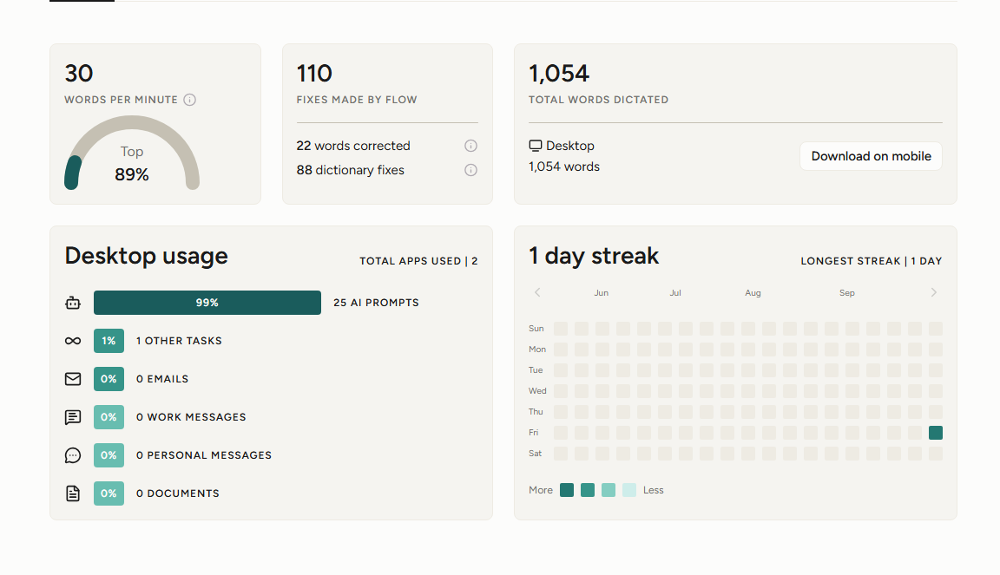

# ExamPilot 🎓

> **Your exam plan built from your own question bank.**

---

### 🔗 Links & Media
- **Live Demo:** [Insert Live Link Here](https://your-live-demo-url.com)
- **Voice Workflow Demo:**
  
  
  *(Wispr Flow dictation in action)*

---

## ⚡ One-Line Pitch
ExamPilot is a zero-dependency, voice-built study planner that converts official university question banks into structured, daily exam preparation schedules tailored to difficulty and remaining days.

---

## ✨ Features
- **Question Bank Integration:** Pre-loaded with official question banks across 4 subjects (Deep Learning, Optimization Techniques, Embedded Systems, and Human Resources & Project Management) with 5 units each, categorizing short and long questions with mark weights.
- **Smart Planning Engine:**
  - Automatically spreads study tasks across available days leading up to the exam.
  - Shifts harder subjects earlier in the schedule.
  - Enforces a strict cognitive limit of at most 4 tasks per day.
  - Automatically reserves the final 2 days before each exam for revision.
  - Ensures no tasks are ever scheduled past the exam date.
- **Feasibility & Timeline Guard:** Verifies whether a plan is mathematically possible before generating, warning you with minimum required days and suggestions if an exam date is too close.
- **Interactive Question Checklists:** Every scheduled task expands into its full question set with individual checkboxes; tasks turn green with a strikethrough once all questions are completed.
- **Live Progress & Readiness Tracking:**
  - Real-time overall question completion bar.
  - Individual subject readiness percentages on every card.
  - Dedicated "Today's Focus" dashboard showing immediately actionable tasks.
- **Daily Streak Counter:** Automatically logs active study days and increments your streak whenever questions are ticked.
- **Urgent Exam Highlighting:** Subject cards dynamically flag exams with fewer than 3 days remaining.
- **Local Storage Persistence:** Keeps subjects, generated plans, completed questions, and study streaks saved locally so no progress is lost on page refresh.
- **Modern Dark UI:** Clean dark aesthetic with an Electric Indigo accent, smooth hover lifts and glows, and responsive styling optimized for mobile phones and desktops.
- **Zero Dependencies:** Crafted purely in vanilla HTML5, CSS3, and JavaScript with no external libraries or build setups.

---

## 🚀 How to Run It

ExamPilot requires no installation, compilers, or background services:

1. Clone or download this repository to your local machine:
   ```bash
   git clone https://github.com/your-username/ExamPilot.git
   ```
2. Navigate into the project folder:
   ```bash
   cd ExamPilot
   ```
3. Open `index.html` in any modern web browser (Google Chrome, Microsoft Edge, Firefox, or Safari):
   - Double-click `index.html`, or
   - Right-click and choose **Open with > Browser**, or
   - Run a local static server if desired:
     ```bash
     python -m http.server 8000
     ```
     and visit `http://localhost:8000`.

---

## 🎙️ Built with My Voice

ExamPilot was built entirely without typing on a keyboard. Every single line of code—from the HTML structure, CSS design tokens, and JavaScript algorithms, to data extraction, bug fixes, and this documentation—was created using **Wispr Flow** voice dictation.

By combining voice dictation with iterative prompt-driven engineering, ExamPilot demonstrates that comprehensive, production-ready web applications can be conceived, coded, and refined purely through speech.

---

## 📝 Note on Questions & Usage
The question banks included in this application are extracted from KHIT (Kallam Haranadhareddy Institute of Technology) department question papers and model papers. This application is intended solely for personal study, revision tracking, and academic preparation.
